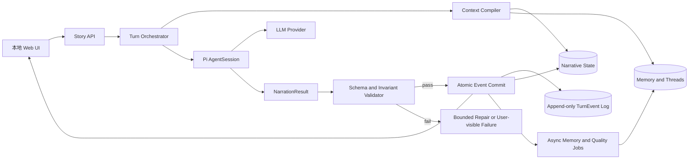

# 互动分支小说 Agent 调研报告与 MVP 方案

> 版本：v0.1（决策调研版）  
> 调研日期：2026-08-11  
> 目标形态：本地 Web、用户每回合触发、中文文字冒险、结构化世界状态

## 结论先行

建议采用 **Pi 作为 Agent 运行时，另加一个小说领域层**，而不是修改 Pi 的核心循环或把整个小说系统建在提示词和会话摘要上。

Pi 已经提供了本项目最难重新实现的一部分基础设施：模型/Provider 适配、流式 Agent Loop、可取消的 SDK 会话、会话树、分支导航、上下文压缩、扩展事件和持久化 Session。官方 SDK 的 `createAgentSession()`、`session.subscribe()`、`steer/followUp` 和 `navigateTree()` 可覆盖本地 Web 的单回合交互与分支浏览需求（[Pi SDK](https://pi.dev/docs/latest/sdk)）。

但 Pi 不知道“人物是否真的知道这件事”“物品是否已经消耗”“某个伏笔是否已兑现”，也不会替小说系统自动保证因果一致性。因此世界状态、记忆、状态增量校验、分支快照、叙事质量评估和原子提交必须由应用层拥有。

首版应做成低复杂度的文字冒险：一个主角、有限重要 NPC、自由行动输入、每回合 2–4 个建议选项、可创建和回退分支。暂不加入战斗数值、多 Agent NPC、MCTS、定时生成和长篇自动写作流水线。

## 1. 需求边界与证据说明

### 1.1 已锁定的产品决策

| 维度 | 首版决定 |
| --- | --- |
| 交互 | 用户输入行动或点击建议选项后，生成下一段剧情 |
| 叙事 | 文字冒险，不先做复杂 RPG 数值系统 |
| 载体 | 本地 Web，能展示正文、选项、分支树和回退 |
| 状态 | 结构化状态为真相，模型只能提出 `StateDelta` |
| 触发 | 用户触发，不做后端定时生成 |
| 用户模型 | 单用户、本地优先 |
| 语言 | 中文 |

### 1.2 头条参考产品的证据缺口

用户提供的短链为：[https://m.toutiao.com/is/zI9RwgCUci8/](https://m.toutiao.com/is/zI9RwgCUci8/)。当前抓取环境无法从该短链解析出稳定的标题、正文或产品名称，搜索结果也不足以确认其功能。因此本报告只将它作为“交互灵感来源”，不对该产品的具体实现、生成频率、技术栈或商业指标作事实判断。

如果后续需要做逐项产品复刻，应补充页面截图、产品名称、正文摘录或可访问的长链接，再单独增加产品体验拆解。

### 1.3 研究基线

- 本地 Pi 源码：`/Users/saul/Documents/ChatGPT/AI Information/pi`，Git 基线为 `v0.84.1`、提交 `53fa77c`。
- 本地既有解析：[PI_AGENT_ARCHITECTURE_TUTORIAL.zh-CN.md](PI_AGENT_ARCHITECTURE_TUTORIAL.zh-CN.md)。
- Pi 官方文档：[SDK](https://pi.dev/docs/latest/sdk)、[Session Format](https://pi.dev/docs/latest/session-format)、[Extensions](https://pi.dev/docs/latest/extensions)、[Compaction](https://pi.dev/docs/latest/compaction)。
- 代码阅读重点：`packages/agent/src/agent-loop.ts`、`packages/agent/src/agent.ts`、`packages/coding-agent/src/core/sdk.ts`、`packages/coding-agent/src/core/session-manager.ts`、`packages/coding-agent/src/core/extensions/runner.ts`。

## 2. 方案与项目调研

### 2.1 Pi：适合做运行时，不是小说领域引擎

Pi 的职责可以拆成三层：

1. `pi-ai` 负责不同模型 Provider 的统一调用。
2. `pi-agent-core` 负责模型调用、工具调用、事件和 Agent 状态。
3. `pi-coding-agent` 负责 SDK、Session、资源发现、扩展、压缩和交互运行时。

与本项目直接相关的能力如下：

| Pi 能力 | 对互动小说的用途 | 是否足够 |
| --- | --- | --- |
| `createAgentSession` | 建立单个故事会话和资源加载器 | 足够作为入口 |
| `session.subscribe` | 把正文 token、状态和生命周期事件推送给 Web | 足够 |
| `steer/followUp` | 处理中途用户输入和后续动作 | 足够，但首版可只使用普通 `prompt` |
| Session JSONL 树 | 保存交互历史、分叉和回退位置 | 可复用，但不是领域状态真相 |
| `navigateTree` | 浏览故事会话分支 | 可复用，需和领域分支绑定 |
| Compaction | 压缩长对话历史 | 可复用，不能代替结构化记忆 |
| Extension hooks | 注入上下文、拦截工具、记录审计、定制压缩 | 足够扩展 |
| Provider 适配 | 切换云模型或本地模型 | 足够，需做模型质量评测 |
| 内置工具 | 文件、Shell 等通用工具 | 首版不应开放 |

Pi Session 采用 `id/parentId` 形成树；分支、压缩和自定义条目都属于会话层（[Session File Format](https://pi.dev/docs/latest/session-format)）。这意味着它能保存“用户做过哪些选择”，但不能天然表达“这个选择改变了哪些世界变量”。

Pi 的 `tool_call` 可以阻止或修改工具调用，`tool_result` 可以修改工具结果，`session_before_compact` 可以定制压缩摘要（[Extensions](https://pi.dev/docs/latest/extensions)）。这些钩子适合接入小说状态校验，但状态提交仍应由领域服务完成，不能依赖模型自己遵守提示词。

### 2.2 最接近目标的开源项目

| 项目 | 主要贡献 | 对本项目的价值 | 注意事项 |
| --- | --- | --- | --- |
| [InkOS](https://github.com/Narcooo/inkos) | 长篇创作、Play 开放世界、Branching Interactive、持久化故事状态、审校和回滚 | 最接近“Pi + 小说工作台”的整体参考，尤其是将生产线和互动 Play 分开 | 仓库采用 AGPL-3.0；只能借鉴架构，不能直接复制代码到闭源产品 |
| [openovel](https://github.com/Feed-Scription/openovel) | 前台低延迟叙事 + 后台异步维护；追加式场景日志；普通文件承载 canon、memory、state | 最适合首版回合协议：前台只生成正文，后台维护状态、记忆和质量资料 | 项目仍处于 beta，需要自行验证其数据一致性和并发边界 |
| [WorldLines](https://github.com/LudicDynamics/WorldLines) | 文件事件溯源、快照、Branch/Undo/Redo、自动上下文、Plan–Diff–Validate–Apply | 为状态真相、回放、分支隔离和 schema 化增量提供清晰范式 | 其游戏引擎范围大于首版小说 MVP，不能照搬全部 Agent 编排 |
| [NarrativeEngine-P](https://github.com/Sagesheep/NarrativeEngine-P) | 自托管 AI DM、持久化战役、NPC 和世界管理 | 可参考世界管理和多会话体验 | 偏 RPG/DM，首版不引入复杂规则 |
| [AuthorAgent](https://github.com/Ckokoski/AuthorAgent) | 长书记忆、series bible、plot promise、审校和回写 | 可参考连续性检查和长期创作资料结构 | 目标是自主写作，不是用户每回合互动 |
| [NovelGenerator](https://github.com/KazKozDev/NovelGenerator) | 规划、章节槽位、审核和修订 | 可参考结构化计划与人工审核门 | 偏一次性长篇生成，实时回合链路较弱 |
| [novel-studio](https://github.com/Xiaoyangy/novel-studio) | 冻结契约、世界模拟、审查、修复、检查点和可追溯证据 | 可参考“先规划、再生成、再审计、再提交”的质量治理 | 适合长篇生产，首版应削减流程 |

### 2.3 相关研究方向

| 研究 | 关键启示 |
| --- | --- |
| [Memory-Augmented Language Models for Persistent Interactive Narratives](https://wordplay-workshop.github.io/pdfs/10.pdf) | 将结构化 Narrative State Memory 与对话历史分开；提示词使用紧凑状态和最近回合，而不是无限堆积历史 |
| [Amory](https://aclanthology.org/2026.eacl-long.183.pdf) | 将情节线程、语义记忆和事件记忆分层，并按叙事层级检索，而不是只依赖向量相似度 |
| [Narrative Studio](https://arxiv.org/abs/2504.02426) | 分支树和实体图能帮助用户探索候选剧情；MCTS 可用于后续分支筛选，但不应成为 MVP 依赖 |
| [StoryWriter](https://arxiv.org/abs/2506.16445) | 先做事件关系规划，再生成文本，并动态压缩历史，有利于长程连贯性 |
| [Plan-And-Write](https://arxiv.org/abs/1811.05701) | 显式故事线规划通常比完全自由生成更稳定 |
| [LongStory](https://arxiv.org/abs/2311.15208) | 长程和短程上下文需要不同权重，同时要保留结构位置和章节关系 |
| [Creating Suspenseful Stories](https://arxiv.org/abs/2402.17119) | 悬念、节奏和伏笔回收不能只靠一次提示词，必须通过计划、审计和迭代验证 |

## 3. 普遍痛点

### 3.1 状态漂移

模型容易忘记人物关系、物品消耗、地点变化和已知事实。把所有历史塞进上下文会增加成本和噪声，单纯摘要又会丢失精确状态。

**对策：** 使用结构化 `NarrativeState` 保存当前真相，使用事件日志记录变化，使用摘要和记忆只作为检索材料。

### 3.2 分支只是措辞变化

很多“互动小说”表面上提供选项，实际每条路径都会回到同一个情节点。用户的行动没有改变后续资源、人物关系或信息可见性，最终体验退化为线性聊天。

**对策：** 每个回合必须产生可测试的 `StateDelta`；分支状态必须隔离；后续提示词只能读取当前分支状态。

### 3.3 模型越权修改世界

让模型直接写 JSON、Markdown 或数据库会导致非法字段、重复提交、越权变更和部分写入。

**对策：** 模型只返回提案；应用侧执行 schema 校验、不变量校验、权限检查和原子提交。

### 3.4 记忆检索过量或错误

向量检索可以找到相似句子，却不一定找到当前剧情真正需要的事实；把所有世界设定注入提示词也会挤压正文空间。

**对策：** 将记忆分为当前状态、近期 canon、长期事实、剧情线程、人物私有知识和用户偏好；按地点、人物、线程和时间做确定性筛选，再用语义检索补充。

### 3.5 延迟、成本和后台竞争

每回合同时调用导演、叙事、审校、记忆和多个 NPC Agent，质量可能提升，但响应变慢、成本变高，也更容易出现部分失败。

**对策：** 前台只有一次主叙事调用；选项生成可作为轻量后置调用；记忆整理、质量检查和剧情线程更新异步进行。

### 3.6 分支爆炸与恢复

用户会反复试错、回退、从旧节点继续。只保存线性聊天无法可靠恢复对应世界状态。

**对策：** 每个领域事件绑定父事件、状态版本和快照哈希；分支创建从事件节点复制状态引用；回退只改变当前指针，不删除历史。

### 3.7 作者意图与用户自由

过度限制会像按钮式视觉小说，过度开放又会破坏世界规则和人物动机。

**对策：** 将世界契约、叙事语气、不可违反的规则和允许的自由度分开；自由行动可以失败，但失败也要产生有意义的状态结果。

### 3.8 叙事质量

模型容易重复句式、快速解决冲突、遗忘伏笔、让 NPC 失去目标，或者把行动结果写成泛化的“剧情继续”。

**对策：** 保存活动剧情线程、承诺/伏笔、人物目标和最近重复模式；后台审计只产出告警和建议，不能未经验证直接覆盖 canon。

## 4. Pi 可行性评估

| 能力 | Pi 能否解决 | 需要额外实现 |
| --- | --- | --- |
| 多模型接入和切换 | 可以 | 小说模型质量、中文风格和成本评测 |
| 流式输出与取消 | 可以 | Web SSE/WebSocket 适配 |
| 用户回合消息 | 可以 | 行动解析和输入规范化 |
| Session 持久化 | 可以 | 领域事件和世界状态持久化 |
| 会话分支导航 | 可以 | Session 节点与领域 `BranchRef` 映射 |
| 上下文压缩 | 可以 | 自定义摘要内容，避免丢掉剧情事实 |
| 工具拦截与审计 | 可以 | 领域工具和状态校验器 |
| 世界状态一致性 | 不可以直接解决 | schema、业务不变量、原子提交 |
| 记忆检索 | 不可以直接解决 | 记忆分层、索引、召回和去重 |
| 叙事因果与悬念 | 不可以直接解决 | 计划、剧情线程、质量评测和回归集 |
| 分支合并 | 不可以直接解决 | 冲突检测、状态差异和人工选择策略 |
| 内容安全 | 只能提供运行时钩子 | 内容策略、分类器、拒答和人工审核 |

**结论：** Pi 能显著降低运行时和会话工程成本，但不能把“小说 Agent”变成开箱即用能力。最合理的边界是：Pi 管 Agent，领域层管世界，Web 管体验。

## 5. 建议的 MVP 架构

### 5.1 组件划分



### 5.2 回合协议

1. Web 发送 `storyId`、`branchId` 和用户行动。
2. Orchestrator 检查当前分支是否空闲，读取状态版本。
3. Context Compiler 根据人物、地点、时间和活动线程选择上下文。
4. Pi 运行一次受限工具集的 AgentSession，要求返回结构化结果和正文。
5. Validator 检查 JSON schema、人物知识边界、前置条件、资源变化、时间顺序和状态版本。
6. 通过后以事务方式追加 `TurnEvent`、更新状态、创建新叶节点。
7. Web 流式展示正文和选项；后台异步整理长期记忆和质量告警。
8. 失败时保留原状态，记录错误事件，允许有限次数重试或让用户重新输入。

### 5.3 最小 TypeScript 契约

```ts
type NarrativeState = {
  version: number;
  time: { label: string; tick: number };
  locationId: string;
  protagonistId: string;
  characters: Record<string, {
    goal: string;
    disposition: string;
    alive: boolean;
    knownFactIds: string[];
  }>;
  inventory: Record<string, number>;
  facts: Record<string, { value: string; visibility: "public" | "private" }>;
  activeThreads: Array<{
    id: string;
    promise: string;
    status: "open" | "resolved" | "failed";
    priority: number;
  }>;
};

type StateDelta = {
  operations: Array<{
    op: "set" | "add" | "remove" | "append";
    path: string;
    value?: unknown;
  }>;
  rationale: string;
};

type NarrationResult = {
  prose: string;
  choices: Array<{ id: string; label: string; intent: string }>;
  openLoops: string[];
  delta: StateDelta;
  warnings: string[];
};

type TurnEvent = {
  id: string;
  storyId: string;
  branchId: string;
  parentEventId: string | null;
  input: string;
  narration: NarrationResult;
  stateBeforeVersion: number;
  stateAfterVersion: number;
  stateHash: string;
  committedAt: string;
  status: "committed" | "rejected" | "failed";
};
```

实际实现时应使用 TypeBox/Zod 等 schema 工具生成运行时校验，并为每种 `path` 定义允许的操作集合，避免模型通过任意路径修改状态。

### 5.4 持久化布局

首版可用 SQLite 或普通文件；建议先抽象 Repository 接口，默认 SQLite：

```text
stories
branches
branch_snapshots
turn_events
narrative_states
memory_items
plot_threads
quality_findings
```

必要约束：

- `turn_events` 追加式写入，不覆盖历史。
- `narrative_states.version` 单调递增。
- 提交条件包含 `branchId + stateBeforeVersion`，防止并发覆盖。
- 每次提交保存 `stateHash`，便于回放和诊断。
- 分支删除只删除展示引用，不删除父事件和共享历史。

### 5.5 Pi 接入方式

- 用 `createAgentSession()` 创建每个故事或回合的运行时。
- 用自定义 Extension 注入世界契约、当前状态摘要和相关记忆。
- 只注册 `read_narrative_context`、`propose_state_delta` 等领域工具，不注册通用 `bash`、`write`、`edit`。
- 在 `tool_call` 阶段拦截非法参数，在 `tool_result` 阶段记录工具审计。
- 在 `session_before_compact` 阶段生成包含当前剧情线程、关键状态和分支信息的自定义摘要。
- 将 Pi 的 Session 节点 ID 映射到 `TurnEvent`，但以领域状态版本和事件日志作为真相。

## 6. 分支、记忆与质量策略

### 6.1 分支模型

分支创建只需要保存一个父事件指针和状态快照引用。新行动追加到新分支，不修改旧分支。回退操作改变 `currentLeafEventId`，而不是删除事件。

首版不做自动分支合并；当用户需要合并两个未来时，先显示状态差异，再由用户选择目标分支。自动合并会引入人物关系、物品和知识冲突，应该放到后续版本。

### 6.2 记忆分层

- 当前状态：必须注入，来源是结构化状态。
- 最近 canon：保留最近 3–8 回合，用于文风和局部连续性。
- 长期事实：人物、地点、世界规则和已确认事件。
- 剧情线程：伏笔、承诺、目标、风险和解决状态。
- 私有知识：某个 NPC 知道但主角不知道的内容。
- 用户偏好：叙事速度、风格、禁用内容和互动习惯。

记忆写入由后台任务提出，由领域服务去重、设置来源和置信度后提交。任何记忆都不能自动覆盖已经提交的世界状态。

### 6.3 叙事质量

首版使用轻量规则和离线评测，不引入复杂多 Agent 审稿链：

- 人物目标是否持续存在。
- 角色是否使用了自己不应知道的信息。
- 物品和关系变化是否有事件依据。
- 活动剧情线程是否被无故遗忘。
- 最近 N 回合是否出现高重复片段。
- 用户行动是否产生了可观察后果。

后台审计输出 `QualityFinding`，默认只告警，不自动重写已提交正文。

## 7. 实施顺序

### 阶段 A：领域内核

- 定义 `NarrativeState`、`StateDelta`、`TurnEvent` 和 `BranchRef`。
- 实现 schema 校验、业务不变量校验和原子提交。
- 用固定脚本生成 10–20 个测试回合，不依赖模型。

### 阶段 B：Pi 运行时适配

- 封装 `PiStoryRuntime`，隔离 Pi v0.84.1 API。
- 接入流式事件、取消、错误和压缩钩子。
- 实现结构化输出解析和有限修复重试。

### 阶段 C：本地 Web

- 故事创建页、回合阅读页、行动输入框、建议选项。
- 分支树、分支切换和回退。
- 显示当前地点、时间、重要人物和状态变化。

### 阶段 D：记忆与后台任务

- 实现活动剧情线程和长期事实。
- 在回合提交后异步整理记忆和质量告警。
- 增加回放、导出和诊断页面。

## 8. 验证与验收

### 8.1 自动化测试

- schema：缺字段、错误类型、未知操作、非法路径。
- 不变量：物品不能凭空增加；死亡角色不能继续行动；私有事实不能注入主角已知列表。
- 幂等：同一个 `idempotencyKey` 重试不能产生两次状态变更。
- 分支：两个分支分别修改关系和物品时互不污染。
- 回放：从事件日志重建的状态哈希必须与快照一致。
- 压缩：压缩前后的关键状态、活动线程和当前分支不丢失。
- 故障：模型超时、非法 JSON、用户取消和后台失败不会污染已提交状态。

### 8.2 长程故事集

准备 3 类固定场景：侦探、冒险、情感关系，每类至少 50 回合，包含：

- 早期埋下、后期回收的线索。
- 角色不知道但用户知道的秘密。
- 用户在旧分支回退后做出不同选择。
- 资源消耗、关系变化和地点移动。
- 违反世界规则的自由行动。

### 8.3 产品指标

- 首字延迟：目标不超过 3 秒。
- 合法状态提交率：目标至少 99%。
- 50 回合关键状态一致性：目标至少 95%。
- 失败回合不可产生不可恢复的部分提交。
- 用户能在 3 次操作内从分支树回到任意已提交节点。

## 9. 风险与应对

| 风险 | 应对 |
| --- | --- |
| 模型质量差异 | 固定评测集，按 Provider 和模型记录结果，不把单一模型行为写死在领域层 |
| 上下文过长 | 当前状态、活动线程和最近 canon 分层注入，配合 Pi 压缩 |
| 状态校验阻塞体验 | 首版优先快速拒绝和有限重试，明确展示“本回合未提交” |
| 分支数量失控 | 默认只保留用户主动创建的分支，提供命名和归档，不自动生成大量未来 |
| 多 Agent 复杂度 | 前台单 Agent，后台异步任务；只有质量瓶颈被证实后再拆分 Agent |
| 内容安全 | 在输入、生成和导出阶段增加策略检查；对未成年人、现实人物和违法内容设置独立规则 |
| Pi 版本变化 | 只通过 `PiStoryRuntime` 适配器使用 Pi，锁定 v0.84.1 并保留升级测试 |
| 开源许可证 | Pi 本身采用 MIT；InkOS 仅做架构参考，禁止未经审查复制 AGPL-3.0 代码 |

## 最终决策

Pi 适合作为本项目的基座，但成功关键不在“让 Pi 写得更多”，而在于建立一个由应用掌握真相的叙事状态系统：模型负责提出行动结果，应用负责验证、提交、分支和恢复。

最小可行路径是：**结构化状态 + 追加事件日志 + Pi Session 树 + 单回合前台叙事 + 异步后台记忆维护 + 本地 Web 分支浏览**。这条路径能先验证互动小说最核心的两个问题：用户行动是否真的改变世界，以及 50–100 回合后世界是否仍然可信。

