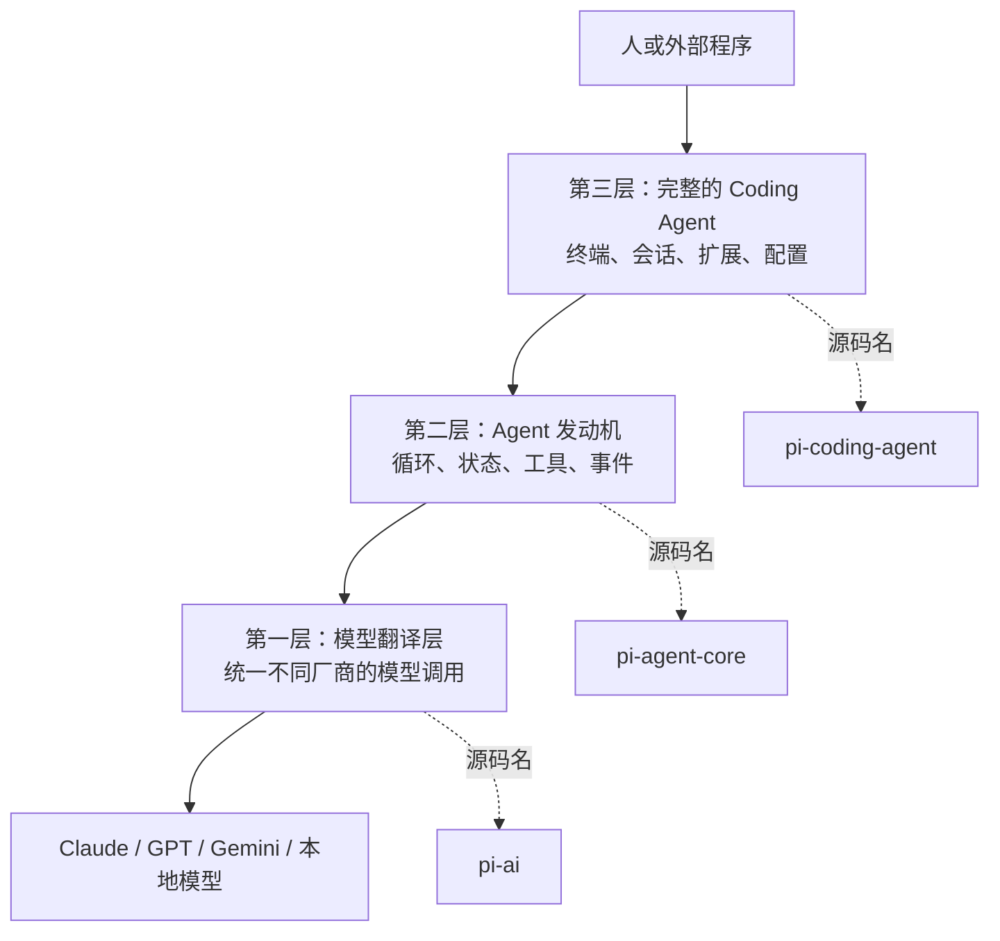
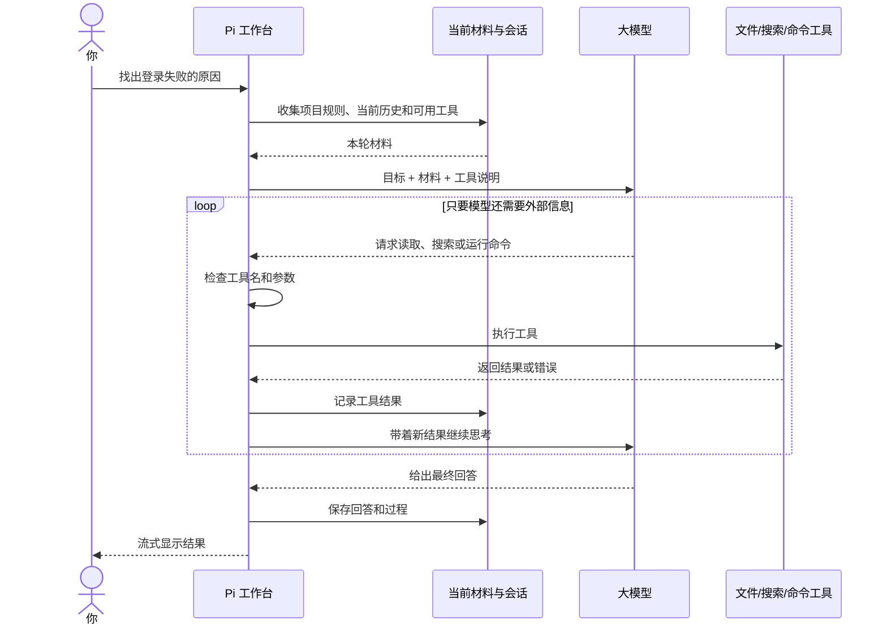
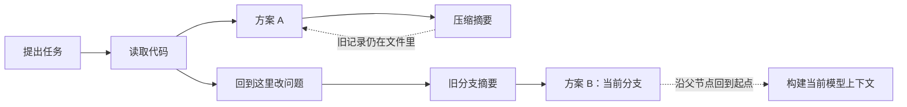

# Pi Agent v0.84.1 中文架构教程：先看懂，再看代码

> 适合刚入行程序员，目标阅读时间约 30 分钟  
> 源码基线：[earendil-works/pi `v0.84.1`](https://github.com/earendil-works/pi/tree/v0.84.1)，提交 [`53fa77c`](https://github.com/earendil-works/pi/commit/53fa77ccd8a279eb87e92294ef3687b03ff80112)  
> 文档基线：[Pi 官方文档](https://pi.dev/docs/latest)，核对日期：2026-08-10

这篇教程不要求你记住大量类名和接口。读完后，你只需要能回答五个问题：

1. Pi 和大模型是什么关系？
2. 一条用户消息为什么会变成多轮“模型调用工具”的过程？
3. Pi 怎样记住历史，又怎样避免把全部历史都塞给模型？
4. Tool、Skill、Extension 分别解决什么问题？
5. 如果用 Pi 作为自己的 Agent 基座，应该从哪一层开始改？

文中偶尔会出现两种提示：

- **文档事实**：Pi 官方文档直接说明的行为。
- **源码观察**：根据 `v0.84.1` 代码得到的理解，帮助你看懂设计思路，但不代表未来版本永远不变。

## 先认识七个词

| 词 | 先这样理解就够了 |
|---|---|
| Agent | 能反复思考、行动、观察结果的软件执行者 |
| Agent Loop | “问模型 -> 用工具 -> 把结果告诉模型 -> 再问模型”的循环 |
| Tool | Agent 的手，例如读文件、搜索、运行命令 |
| Context | 这一轮真正交给模型阅读的材料 |
| Session | 保存完整工作过程的会话记录 |
| Provider | 不同模型厂商的接入适配层 |
| Extension | 能深入改变 Pi 行为的 TypeScript 插件 |

## 阅读路线

1. [Pi 到底是什么](#section-1)
2. [从三层楼理解 Pi 的源码](#section-2)
3. [一次请求是怎样跑完的](#section-3)
4. [Pi 的三种“记忆”](#section-4)
5. [Session 为什么是一棵树](#section-5)
6. [Tool、Skill、Extension 有什么区别](#section-6)
7. [Pi 怎样接入不同模型](#section-7)
8. [四种使用方式怎么选](#section-8)
9. [安全边界在哪里](#section-9)
10. [用最少代码建立直觉](#section-10)
11. [第一次应该怎样读源码](#section-11)
12. [作为 Agent 基座，Pi 值得借鉴什么](#section-12)
13. [附录：官方文档完整地图](#docs-map)

<a id="section-1"></a>

## 1. Pi 到底是什么

先想象你请来了一位坐在电脑前的助手。

- 大模型是他的“大脑”，负责理解、推理和决定下一步。
- Tool 是他的“手”，让他能读文件、搜索内容、运行命令。
- Context 是你每次放到他桌上的资料。
- Session 是工作日志，记录他做过什么、为什么这样做。
- Pi 是那个负责整理资料、传话、安排工具、保存日志和控制流程的“工作台”。

所以，**Pi 不是大模型本身，而是让大模型能够持续做事的运行框架。** 官方使用的词是 Agent Harness，可以理解成“Agent 的支架和控制台”。

如果没有 Pi 这类框架，一次模型调用通常是：

```text
你问一句 -> 模型答一句 -> 结束
```

有了 Pi，过程变成：

```text
你提出目标
  -> 模型认为需要看文件
  -> Pi 执行读文件工具
  -> 模型看到文件内容后决定搜索代码
  -> Pi 执行搜索工具
  -> 模型整合结果并回答
  -> Pi 保存整个过程
```

Pi 也不是一个固定流程平台。它不会要求所有任务都按照预先画好的流程图执行。模型可以根据刚刚看到的结果，临时决定下一步。

Pi 还不是开箱即用的多 Agent 系统。Plan Mode、Sub-agent、待办列表、权限确认等能力可以加上，但官方有意把它们留在插件层，而不是塞进最小核心。

> **文档事实**：Pi 把自己描述成“minimal terminal coding harness”，核心保持小，通过 Extension、Skill、Prompt Template、Theme 和 Package 扩展。
>
> **源码观察**：Pi 真正提供的不是某个神奇提示词，而是一套“让模型持续工作”的秩序：什么时候问模型、什么时候执行工具、怎样保存结果、什么时候继续或停下。

<a id="section-2"></a>

## 2. 从三层楼理解 Pi 的源码

Pi 的仓库里有很多目录，但刚开始只要理解三层。



### 第一层：模型翻译层

Claude、GPT、Gemini 的请求格式、认证方式、思考模式和流式返回都不同。这一层把差异翻译成 Pi 能理解的统一形式。

你可以把它想成万能电源适配器：上面的 Agent 发动机只认一种插头，不需要知道墙后面接的是哪家电网。

源码目录叫 `pi-ai`。

### 第二层：Agent 发动机

这一层负责最核心的循环：

1. 把当前材料交给模型。
2. 接收模型的流式回复。
3. 如果模型要求使用工具，就执行工具。
4. 把工具结果放回对话。
5. 再问模型，直到任务结束。

它还保存当前模型、工具列表、消息和运行状态，并不断发出“开始回答了”“工具执行完了”之类的状态通知。

源码目录叫 `pi-agent-core`。

### 第三层：完整的 Coding Agent

只靠发动机还不能成为我们日常使用的 Pi。最上层继续加上：

- 终端界面。
- 会话文件和历史分支。
- 长对话压缩。
- 项目说明文件和 Skill。
- Extension 插件系统。
- 模型登录、配置、重试和切换。
- Interactive、JSON、RPC 等使用方式。

源码目录叫 `pi-coding-agent`。

### 其他目录先放在哪里

| 目录 | 通俗理解 |
|---|---|
| TUI | 负责把内容漂亮、高效地画在终端上 |
| Protocol / Client / Server | 为远程控制 Session 准备的一套通信能力 |
| Session Backend | 尝试把更耐久的 Session 存进 SQLite 等后端 |
| Telemetry | 记录一次调用花了多久、在哪里失败，供日志或监控使用 |

其中 Server、远程 Protocol 和新的 durable AgentHarness 在 `v0.84.1` 仍属于正在演进的部分。仓库明确说明这些 API 和存储格式可能变化。学习当前稳定 Pi 时，应先沿着“模型翻译层 -> Agent 发动机 -> Coding Agent”这条主线走。

最重要的边界是：

> 终端界面不是 Agent，Session 文件也不是 Agent。它们都围绕中间的 Agent 发动机工作。

<a id="section-3"></a>

## 3. 一次请求是怎样跑完的

假设你对 Pi 说：“找出项目里登录失败的原因并解释。”

一次完整过程大致如下：



### 3.1 模型并不能直接碰你的电脑

模型只能输出一个“我想调用某工具”的结构化请求。例如它可能表达：

```text
使用 read_file，参数是 path = "src/login.ts"
```

Pi 收到后才会：

1. 检查这个工具是否真的存在。
2. 检查参数是不是符合要求。
3. 让插件判断是否要阻止这次操作。
4. 真正执行工具。
5. 把成功或失败结果交还给模型。

因此 Tool 是模型和真实世界之间的关口。设计自己的 Agent 时，Tool 的边界通常比提示词更重要。

### 3.2 工具失败也是一种有用的观察

如果工具抛出错误，Pi 通常不会让整个 Agent 直接崩溃，而是把错误包装成工具结果告诉模型。

例如：

```text
模型：读取 config/prod.json
工具：文件不存在
模型：那我先搜索所有 config 文件
```

错误被放回循环后，模型有机会调整计划。

### 3.3 多个工具默认可以并行

如果模型一次要求读取三个互不相关的文件，Pi 默认可以同时执行，减少等待时间。

但并行会带来顺序问题，所以 Pi 做了一个很实用的折中：

- 谁先执行完，界面就先显示谁完成。
- 写回给模型的最终工具结果，仍保持模型原本提出的顺序。
- 如果其中某个工具明确要求串行，整批工具都会一个接一个执行。

你可以把它理解成：几个同事可以同时查资料，但秘书最后仍按任务清单的顺序整理报告。

### 3.4 什么时候继续，什么时候停

- 模型没有再调用工具，通常表示本轮可以结束。
- 如果工具参数可能因为输出截断而不完整，Pi 不会冒险执行，而是返回错误让模型重新发起。
- 用户可以取消当前工作，取消信号会传给模型请求和工具。
- 用户在 Agent 工作时追加的“马上改方向”消息，会在当前工具批次结束后生效。
- “做完后再处理这个”消息，会等原任务本来要结束时再进入。

Pi 内部会不断发出状态通知。终端、JSON 输出、RPC 客户端和 Session 保存都可以监听这些通知。你暂时不用记事件名称，只要知道：**一次运行不是黑盒，外层可以持续观察它正在做什么。**

还有一个细节：底层循环结束后，上层可能还要自动重试、压缩上下文或处理排队消息。因此“模型这一轮停了”和“整个任务彻底稳定了”是两个时刻。

> **源码观察**：Pi 没让终端界面直接控制模型和工具，而是让中间的事件流把各层连接起来。这使同一套核心过程可以被不同界面复用。

<a id="section-4"></a>

## 4. Pi 的三种“记忆”

理解 Pi 最关键的一步，是不要把“保存过的所有历史”和“这次发给模型的材料”当成同一件事。

可以想象三样东西：

| 比喻 | Pi 中的含义 | 特点 |
|---|---|---|
| 工作台 | 当前运行状态 | 当前模型、工具、消息、是否正在运行 |
| 完整日记 | Session 历史 | 尽量完整保存发生过的事情 |
| 本轮公文包 | Context | 只装这一次模型真正需要阅读的材料 |

### 4.1 为什么不能每次都把完整日记交给模型

模型能阅读的内容有长度上限，而且输入越长，速度和费用通常越高。

所以每次请求前，Pi 会经历三个动作：

```text
完整消息
  -> 选择：哪些内容这轮应该看
  -> 翻译：把应用自己的消息变成模型能理解的消息
  -> 发送：系统说明 + 消息 + 可用工具
```

源码里这两步分别叫 `transformContext` 和 `convertToLlm`。名字不需要背，记住它们分别负责“选材料”和“翻译格式”即可。

这让应用可以保留一些不应该发给模型的内容，例如纯 UI 通知、调试标记或插件自己的状态。

### 4.2 各种信息什么时候进入模型视野

| 信息 | 通俗解释 | 何时进入 |
|---|---|---|
| 系统提示 | Agent 的长期身份和基本做事方式 | 每次模型请求 |
| `AGENTS.md` 等项目说明 | 项目的规矩、命令和偏好 | 启动或 reload 后加入系统材料 |
| Skill 名称与简介 | 告诉模型“这里有哪些专业手册” | 启动后进入系统材料 |
| Skill 完整正文 | 某一本专业手册的详细内容 | 真正需要时才读取 |
| Prompt Template | 用户常用问题的文本模板 | 用户调用模板时展开成普通问题 |
| Extension 注入的信息 | 插件临时增加的规则或材料 | 插件指定的阶段 |
| Tool Result | 文件、命令或外部系统的真实结果 | 工具执行后进入下一轮 |
| Theme | 终端颜色 | 永远不会发给模型 |

Skill 的这种方式叫 progressive disclosure，中文可以理解成“逐步展开”：先只给目录，需要时再打开全文。这样能力很多，但不会让每次请求都背着所有手册。

### 4.3 项目说明文件怎样叠加

Pi 会从全局说明开始，再沿父目录走到当前目录，逐层加入项目说明。

如果某个目录有 `AGENTS.override.md`，它只替换这个目录本来会使用的普通说明，不会抹掉其他目录的内容。

项目说明文件即使在项目未被信任时也会加载。它们不会像 Extension 那样直接运行代码，但文字仍可能诱导模型做危险操作，所以依然应视为外部输入。

> **源码观察**：Pi 把“保存事实”“决定本轮看什么”“转换成模型格式”分成三步。以后为自己的 Agent 加长期记忆或 RAG 时，最好也保留这三个边界。

<a id="section-5"></a>

## 5. Session 为什么是一棵树

普通聊天软件看起来是一条直线：

```text
问题 1 -> 回答 1 -> 问题 2 -> 回答 2
```

但编码工作经常需要回到过去：

- “刚才方向错了，从前一个问题重新来。”
- “保留原方案，再试一个新方案。”
- “回到修改数据库之前。”

如果直接删除或覆盖旧消息，就无法知道以前发生过什么。Pi 的做法更像 Git：旧内容不改，在旧节点后长出一条新分支。

### 5.1 每条记录都知道自己的上一条是谁

Session 保存为 JSONL，可以先理解成“一行记录一件事”。每条记录都有自己的编号和父记录编号。



当前正在工作的分支有一个“活动末端”。当你回到旧记录后，下一条新消息就从那里长出新分支，旧分支不会被覆盖。

这就是 `/tree` 能在同一个 Session 里改道的原因。`/fork` 和 `/clone` 则会创建新的 Session 文件。

### 5.2 Compaction 就像会议纪要

当活动分支越来越长，模型快读不下时，Pi 会：

1. 找到较早的一段完整工作过程。
2. 把它总结成一份结构化纪要。
3. 保留最近的原始消息。
4. 之后给模型看“纪要 + 最近消息 + 新消息”。

原始历史不会被删除。压缩的是模型的阅读材料，不是 Session 日记。

这就像公司不会烧掉会议录像，而是让新加入的人先看会议纪要和最近讨论。

Pi 还会避免把一次工具调用从中间切开。否则模型可能只看到“工具返回了什么”，却不知道“为什么调用这个工具”。

### 5.3 Branch Summary 是换路线时的交接说明

Branch Summary 解决的不是内容太长，而是“我们放弃了刚才那条路线，但里面有些结论仍有用”。

| 机制 | 为什么发生 | 总结什么 |
|---|---|---|
| Compaction | 当前路线太长 | 当前路线较早的内容 |
| Branch Summary | 从旧节点改走另一条路线 | 被放弃路线上的有用进展 |

两者都只增加摘要，不删除原始记录。

> **文档事实**：Pi 的 Coding Agent Session 是追加式 JSONL 树；Compaction 和 Branch Summary 都不会删除完整历史。
>
> **源码观察**：这套设计把“修改过去”变成“从过去增加一个新未来”。它天然适合审计、回退和比较不同方案。

仓库里实验性的 AgentHarness 使用了另一种自包含压缩记录。它和当前 Coding Agent Session 不是同一个稳定格式，初学阶段不要混在一起理解。

<a id="section-6"></a>

## 6. Tool、Skill、Extension 有什么区别

它们都能增强 Pi，但增强方式完全不同。

| 能力 | 最像什么 | 模型能直接调用吗 | 适合做什么 |
|---|---|---|---|
| Tool | 一件具体工具 | 能 | 读文件、查数据库、调用 API |
| Skill | 一本专业工作手册 | 不能直接执行，模型按说明使用其他工具 | PDF 处理、发布流程、代码审查方法 |
| Prompt Template | 一段可填参数的常用提问 | 由用户触发 | 重复使用的任务提示 |
| Theme | 终端皮肤 | 不能 | 改颜色和显示风格 |
| Extension | 深度插件 | 插件可注册新 Tool | 拦截、权限、命令、UI、Provider、Session 行为 |
| Pi Package | 装这些资源的包裹 | 取决于包里有什么 | 通过 npm 或 git 分享能力 |

### 6.1 Tool 是“做一件事”

一个 Tool 通常包含：

- 名字和用途，供模型选择。
- 参数规则，防止模型随便传一段无法理解的数据。
- 真正的执行代码。
- 返回给模型的文字、图片或错误。

Tool 应该尽量小而清楚。“读取一个文件”通常比“自动处理整个项目”更容易控制和调试。

### 6.2 Skill 是“告诉模型应该怎么做”

Skill 本身更像教程。它可以包含说明、脚本、参考资料和模板。

启动时，模型通常只知道 Skill 的名称和简介。任务匹配时，再读取完整说明。这适合把团队经验包装成可复用的方法，而不必修改 Agent 核心。

### 6.3 Extension 是“改变 Pi 本身的行为”

Extension 的能力很大。它可以：

- 在工具执行前阻止危险操作。
- 修改用户输入、系统提示或本轮 Context。
- 注册新工具、命令、快捷键和 Provider。
- 在终端增加对话框、状态栏或自定义编辑器。
- 改写压缩和分支总结。
- 在 Session 中保存自己的状态。

因此权限确认、Plan Mode、Todo、Git checkpoint 都可以作为 Extension 实现。

Sub-agent 也可以这样组合：主 Agent 调用一个“启动子 Agent”的 Tool，Extension 再负责它的 UI、Session 或权限。Pi 没把这套产品选择写死在核心里。

这背后的设计思想是：

> 核心提供可以组合的零件，产品决定最终采用什么工作方式。

### 6.4 Extension 也是受信任代码

Extension 和 Pi 运行在同一个进程里，能拥有当前用户的文件、网络和进程权限。第三方 Package 里如果包含 Extension 或可执行脚本，也需要先审查。

Project Trust 只决定是否加载项目级资源，不会把已加载的 Extension 关进沙箱。

<a id="section-7"></a>

## 7. Pi 怎样接入不同模型

如果 Agent 发动机直接认识每一家模型 API，代码会慢慢变成这样：

```text
如果是 OpenAI，就这样处理
如果是 Anthropic，就那样处理
如果是 Google，再换一套格式
```

这会让工具循环、错误处理和 UI 都被厂商差异污染。

Pi 在中间加了一层 Provider。一个 Provider 大致负责：

- 我是谁，例如 Anthropic、OpenAI 或某个企业网关。
- 我有哪些模型。
- 怎样获得 API key 或 OAuth 登录信息。
- 怎样把统一消息翻译成这家 API 的请求。
- 怎样把返回内容翻译成统一的文字、思考、工具调用和错误事件。

### 7.1 模型清单和模型调用是两件事

Pi 先维护一份模型清单。每个模型带有名称、上下文大小、最大输出、是否支持图片和 reasoning、价格等资料。

真正调用时，再根据模型属于哪个 Provider，把请求交给对应翻译器。

这样终端模型选择器、成本显示和 Agent Loop 都不必理解厂商 HTTP 细节。

### 7.2 Thinking 和缓存差异也留在边界里

不同模型的 thinking 参数不一样，但上层只需要表达“low、medium、high”之类的意图。Provider 再翻译成具体厂商格式。

缓存同样如此。Pi 可以统一统计 cache read/write，但某个 Provider 怎样放缓存标记、支持多久，仍由边界适配器负责。

### 7.3 自定义模型有两条常见路线

- 服务兼容常见 API，例如 Ollama、LM Studio、vLLM：通常在 `models.json` 中添加地址和模型资料即可。
- 服务有特殊认证、OAuth 或完全不同的流协议：用 Extension 注册一个自定义 Provider。

本地 `llama.cpp` router 也在这一层接入，不需要改变 Agent Loop。

> **源码观察**：Pi 把“模型厂商差异”限制在最底层。自己设计 Agent 时，应尽量避免在 Loop 里到处判断模型名称。

<a id="section-8"></a>

## 8. 四种使用方式怎么选

核心 Agent 可以不变，外面换不同入口。

| 使用方式 | 适合谁 | 怎么交流 |
|---|---|---|
| Interactive | 人在终端里直接工作 | 完整终端界面，可输入、选择、查看工具过程 |
| Print / JSON | Shell、CI、一次性脚本 | 输出最终文字，或持续输出结构化事件 |
| RPC | 其他语言、IDE、独立子进程 | stdin/stdout 传一行一条 JSON 命令与事件 |
| SDK | Node.js 应用 | 在同一进程里直接创建和控制 Session |

### 选择原则

- 自己在终端编码：Interactive。
- 只要一个最终答案：Print。
- 流水线想保存完整事件：JSON。
- Python、Go、IDE 等需要控制独立 Pi 进程：RPC。
- Node.js 产品要直接定制 Tool、Extension 和 Session：SDK。

JSON mode 和 RPC 看起来都输出 JSON，但用途不同：

- JSON mode 更像单向直播，只负责持续播报发生了什么。
- RPC 是双向对讲机，外部程序可以继续发送 prompt、取消、切换模型或读取状态。

仓库里还有一套使用 CBOR 的远程 Protocol/Client/Server。它是另一条实验性远程会话路线，不是这里的 JSONL RPC。

### Settings 和环境变量放在哪里理解

Settings 是“启动和运行偏好”：选择默认模型、压缩阈值、重试、消息队列、终端和资源加载方式。全局配置提供默认值，受信任项目的配置可以覆盖它。

环境变量主要分两类：

- 告诉 Pi 配置目录、Session 目录、代理、离线模式和外部编辑器。
- 告诉 bash 工具当前 Session、模型和 thinking level。

它们属于外部运行环境，不是 Agent 自己的长期记忆。

<a id="section-9"></a>

## 9. 安全边界在哪里

最重要的结论是：

> **Project Trust 不是 Sandbox。**

可以用“门禁”和“围墙”区分：

- Project Trust 是门禁：决定项目里的设置、Extension、Skill、Package 能不能被加载。
- Sandbox 是围墙：即使内部代码想作恶，也限制它最多能访问哪些文件、网络和凭据。

Pi 默认没有这堵围墙。它和普通命令行程序一样，继承当前用户的权限。模型如果能调用 bash，就可能执行当前用户能执行的命令。

### 不同保护层各管什么

| 保护方式 | 能解决什么 | 不能解决什么 |
|---|---|---|
| 只开放少量 Tool | 减少模型可以直接使用的能力 | 已开放工具本身可能仍很强 |
| Extension 审批 | 拦截危险命令、保护路径 | Extension 自身仍有宿主权限 |
| Project Trust | 不自动加载未信任项目的可执行资源 | 不限制已经加载的代码 |
| 容器、虚拟机或 OS sandbox | 真正限制文件、进程、网络和凭据 | 错误挂载和过量凭据仍会造成风险 |

官方文档给出三种隔离思路：

- Gondolin：Pi 留在宿主，常用工具进入 microVM。
- Docker：整个 Pi 进入容器，但挂载目录仍可能被修改。
- OpenShell：让整个进程运行在策略控制的 sandbox 中。

如果以后用 Pi 做产品，权限确认只是用户体验的一部分。真正的安全还需要最小权限、只读挂载、网络限制、凭据隔离和外部 sandbox。

<a id="section-10"></a>

## 10. 用最少代码建立直觉

先不看真实接口，用伪代码描述一个最小 Agent：

```text
模型清单 = 注册 Anthropic
模型 = 从清单里选择 Claude

只读工具 = “列出当前目录，但不能写文件”

Agent = 创建一个工作循环(
  使用模型,
  可用工具 = [只读工具],
  基本规则 = “简洁回答”
)

当 Agent 有新文字时：打印出来
让 Agent 处理：“看看这个目录是什么项目”
```

这段伪代码已经包含最小架构：模型、工具、规则、循环和输出观察。

下面是真实的 `v0.84.1` TypeScript 版本。初读时不必记名字，只对照上面的五个部分看。

<details>
<summary>展开真实 TypeScript 示例</summary>

```ts
import { readdir } from "node:fs/promises";
import { Agent, type AgentTool } from "@earendil-works/pi-agent-core";
import { createModels, Type } from "@earendil-works/pi-ai";
import { anthropicProvider } from "@earendil-works/pi-ai/providers/anthropic";

const models = createModels();
models.setProvider(anthropicProvider());

const model = models.getModel("anthropic", "claude-sonnet-4-6");
if (!model) throw new Error("Model not found");

const noParameters = Type.Object({});

const listWorkspace: AgentTool<typeof noParameters, { count: number }> = {
  name: "list_workspace",
  label: "List workspace",
  description: "List names in the current workspace without modifying files",
  parameters: noParameters,
  async execute() {
    const entries = await readdir(process.cwd(), { withFileTypes: true });
    const names = entries
      .map((entry) => (entry.isDirectory() ? `${entry.name}/` : entry.name))
      .sort();

    return {
      content: [{ type: "text", text: names.join("\n") }],
      details: { count: names.length },
    };
  },
};

const agent = new Agent({
  initialState: {
    systemPrompt: "You are a concise coding assistant.",
    model,
    tools: [listWorkspace],
  },
  streamFn: models.streamSimple.bind(models),
});

agent.subscribe((event) => {
  if (
    event.type === "message_update" &&
    event.assistantMessageEvent.type === "text_delta"
  ) {
    process.stdout.write(event.assistantMessageEvent.delta);
  }
});

await agent.prompt("List this workspace, then explain what kind of project it is.");
process.stdout.write("\n");
```

</details>

这个最小例子还没有自动加载项目说明、保存 Session、压缩长历史或运行 Extension。

如果想直接复用完整 Coding Agent，可以使用高层 Session 工厂。仍然先看伪代码：

```text
Session = 创建完整 Pi Session(
  历史先放在内存,
  只开放 read / grep / find / ls
)

监听 Session 的状态
发送问题
完成后释放 Session
```

对应的真实入口是 `createAgentSession()`。它会帮你把模型、工具、资源、设置和 Session 组装起来。

选择哪一层：

- 只想自己做一个简单 Agent Loop：使用底层 Agent。
- 想直接拥有 Pi 的 Session、压缩、Skill 和 Extension：使用完整 Agent Session。
- 不是 Node.js，或希望独立进程运行：使用 RPC。

<a id="section-11"></a>

## 11. 第一次应该怎样读源码

不要从终端 UI 开始，也不要一上来读所有配置。建议带着一个具体问题逐层阅读。

| 顺序 | 文件 | 带着什么问题读 |
|---|---|---|
| 1 | [`agent-loop.ts` 本地](./pi/packages/agent/src/agent-loop.ts) / [`固定版本`](https://github.com/earendil-works/pi/blob/v0.84.1/packages/agent/src/agent-loop.ts) | 模型调用工具后，代码在哪里决定“再问一次”？ |
| 2 | [`agent.ts` 本地](./pi/packages/agent/src/agent.ts) / [`固定版本`](https://github.com/earendil-works/pi/blob/v0.84.1/packages/agent/src/agent.ts) | 一次性的循环怎样变成可取消、可排队的长期对象？ |
| 3 | [`sdk.ts` 本地](./pi/packages/coding-agent/src/core/sdk.ts) / [`固定版本`](https://github.com/earendil-works/pi/blob/v0.84.1/packages/coding-agent/src/core/sdk.ts) | 完整 Pi 是怎样把模型、工具、配置和资源装起来的？ |
| 4 | [`agent-session.ts` 本地](./pi/packages/coding-agent/src/core/agent-session.ts) / [`固定版本`](https://github.com/earendil-works/pi/blob/v0.84.1/packages/coding-agent/src/core/agent-session.ts) | 消息何时保存？重试和压缩何时发生？ |
| 5 | [`session-manager.ts` 本地](./pi/packages/coding-agent/src/core/session-manager.ts) / [`固定版本`](https://github.com/earendil-works/pi/blob/v0.84.1/packages/coding-agent/src/core/session-manager.ts) | 一行行 JSONL 怎样组成树和当前分支？ |
| 6 | [`extensions/runner.ts` 本地](./pi/packages/coding-agent/src/core/extensions/runner.ts) / [`固定版本`](https://github.com/earendil-works/pi/blob/v0.84.1/packages/coding-agent/src/core/extensions/runner.ts) | 插件怎样在关键阶段插入自己的行为？ |
| 7 | [`models.ts` 本地](./pi/packages/ai/src/models.ts) / [`固定版本`](https://github.com/earendil-works/pi/blob/v0.84.1/packages/ai/src/models.ts) | Pi 怎样找到模型并把请求交给正确 Provider？ |
| 8 | [`anthropic.ts` 本地](./pi/packages/ai/src/providers/anthropic.ts) / [`固定版本`](https://github.com/earendil-works/pi/blob/v0.84.1/packages/ai/src/providers/anthropic.ts) | 一个具体 Provider 包含哪些资料和认证方式？ |

阅读时只追两条线：

1. **消息线**：用户消息从哪里进来，工具结果在哪里加入，最终消息在哪里保存。
2. **控制线**：什么条件让循环继续，什么条件让它停止、重试或压缩。

等稳定主线读懂后，再看实验性的 [`AgentHarness`](https://github.com/earendil-works/pi/blob/v0.84.1/packages/agent/src/harness/agent-harness.ts)、[`Protocol`](https://github.com/earendil-works/pi/tree/v0.84.1/packages/protocol)、[`Client`](https://github.com/earendil-works/pi/tree/v0.84.1/packages/client)、[`Server`](https://github.com/earendil-works/pi/tree/v0.84.1/packages/server) 和 [`SQLite Backend`](https://github.com/earendil-works/pi/tree/v0.84.1/packages/session-backends/sqlite-node)。它们主要在解决远程、多 Session、崩溃恢复和耐久运行。

<a id="section-12"></a>

## 12. 作为 Agent 基座，Pi 值得借鉴什么

### 12.1 最终心智模型

```text
人或外部程序
  -> Pi 的交互入口
  -> 完整 Session 层：资源、历史、压缩、重试、插件
  -> Agent 发动机：消息、工具、循环、取消
  -> Provider 翻译层
  -> 大模型

工具把 Agent 连接到文件、命令和外部系统。
Session 保存完整过程，Context 只选择本轮材料。
Extension 把产品策略插入关键阶段。
```

### 12.2 七条值得直接借鉴的原则

1. **模型不是 Agent**：模型只负责判断和生成，外部框架负责行动与秩序。
2. **工具要有明确边界**：工具名、参数、权限和错误都应可理解。
3. **完整历史和本轮 Context 分开**：保存得多，不代表每轮都要发送得多。
4. **历史只追加，不轻易覆盖**：树形记录更容易回退和审计。
5. **把厂商差异关在 Provider 里**：不要让核心循环认识每一家 API。
6. **核心提供机制，插件决定策略**：Plan、权限、Sub-agent 不必写死。
7. **权限确认不是安全隔离**：真正的边界应由容器、VM 或 OS policy 强制执行。

### 12.3 什么时候适合用 Pi

| 很适合 | 需要额外建设或另选方案 |
|---|---|
| 终端 Coding Agent、自定义开发助手 | 严格固定的业务审批流程 |
| Node.js 中嵌入有工具能力的 Agent | 大规模多租户调度与租户隔离 |
| 需要多模型、流式响应和可扩展 Session | 必须完全确定性执行的工作流 |
| 想快速试验 Skill、Plan 或 Sub-agent | 希望开箱即用的成熟多 Agent 平台 |

如果以后以 Pi 为基座，推荐建设顺序是：

1. 先做少量只读 Tool，让最小循环跑起来。
2. 再确定哪些信息保存进 Session，哪些信息进入 Context。
3. 接入完整 Coding Agent 的资源、压缩和 Session。
4. 用 Extension 增加审批、Plan、路径保护和 Sub-agent。
5. 最后再考虑远程服务、耐久运行和多 lane。

这样你会一直知道每个功能属于哪一层，而不是把模型、工具、记忆、UI 和安全都揉进一个巨大类里。

<a id="docs-map"></a>

## 附录：官方文档完整地图

下面覆盖 [Pi 官方文档](https://pi.dev/docs/latest) 的全部 30 个页面。正文只讲架构主线，安装和平台细节在这里索引。

| 你想了解什么 | 官网 / `v0.84.1` 固定文档 | 一句话说明 |
|---|---|---|
| 总体认识 | [Overview](https://pi.dev/docs/latest) / [源码](https://github.com/earendil-works/pi/blob/v0.84.1/packages/coding-agent/docs/index.md) | 官方文档入口和功能地图 |
| 第一次使用 | [Quickstart](https://pi.dev/docs/latest/quickstart) / [源码](https://github.com/earendil-works/pi/blob/v0.84.1/packages/coding-agent/docs/quickstart.md) | 安装、登录、默认工具和第一条消息 |
| 日常操作 | [Using Pi](https://pi.dev/docs/latest/usage) / [源码](https://github.com/earendil-works/pi/blob/v0.84.1/packages/coding-agent/docs/usage.md) | 终端、命令、Context 文件和 CLI 模式 |
| 模型登录 | [Providers](https://pi.dev/docs/latest/providers) / [源码](https://github.com/earendil-works/pi/blob/v0.84.1/packages/coding-agent/docs/providers.md) | 订阅、API key 和云 Provider |
| 本地模型 | [llama.cpp](https://pi.dev/docs/latest/llama-cpp) / [源码](https://github.com/earendil-works/pi/blob/v0.84.1/packages/coding-agent/docs/llama-cpp.md) | 本地 router 和模型管理 |
| 安全概念 | [Security](https://pi.dev/docs/latest/security) / [源码](https://github.com/earendil-works/pi/blob/v0.84.1/packages/coding-agent/docs/security.md) | Trust、权限和 sandbox 边界 |
| 隔离运行 | [Containerization](https://pi.dev/docs/latest/containerization) / [源码](https://github.com/earendil-works/pi/blob/v0.84.1/packages/coding-agent/docs/containerization.md) | Gondolin、Docker、OpenShell |
| 调整行为 | [Settings](https://pi.dev/docs/latest/settings) / [源码](https://github.com/earendil-works/pi/blob/v0.84.1/packages/coding-agent/docs/settings.md) | 模型、压缩、重试、队列和资源设置 |
| 修改按键 | [Keybindings](https://pi.dev/docs/latest/keybindings) / [源码](https://github.com/earendil-works/pi/blob/v0.84.1/packages/coding-agent/docs/keybindings.md) | 默认快捷键与自定义配置 |
| 会话历史 | [Sessions](https://pi.dev/docs/latest/sessions) / [源码](https://github.com/earendil-works/pi/blob/v0.84.1/packages/coding-agent/docs/sessions.md) | 保存、恢复、Tree、Fork 和 Clone |
| 长对话 | [Compaction](https://pi.dev/docs/latest/compaction) / [源码](https://github.com/earendil-works/pi/blob/v0.84.1/packages/coding-agent/docs/compaction.md) | 上下文压缩和分支总结 |
| 深度插件 | [Extensions](https://pi.dev/docs/latest/extensions) / [源码](https://github.com/earendil-works/pi/blob/v0.84.1/packages/coding-agent/docs/extensions.md) | Hook、工具、命令、Provider 和 UI |
| 专业手册 | [Skills](https://pi.dev/docs/latest/skills) / [源码](https://github.com/earendil-works/pi/blob/v0.84.1/packages/coding-agent/docs/skills.md) | 按需加载的能力说明包 |
| 常用提问 | [Prompt Templates](https://pi.dev/docs/latest/prompt-templates) / [源码](https://github.com/earendil-works/pi/blob/v0.84.1/packages/coding-agent/docs/prompt-templates.md) | 带参数的 Markdown 提示模板 |
| 终端配色 | [Themes](https://pi.dev/docs/latest/themes) / [源码](https://github.com/earendil-works/pi/blob/v0.84.1/packages/coding-agent/docs/themes.md) | 自定义 TUI 颜色 |
| 分享扩展 | [Pi Packages](https://pi.dev/docs/latest/packages) / [源码](https://github.com/earendil-works/pi/blob/v0.84.1/packages/coding-agent/docs/packages.md) | 用 npm 或 git 分发资源 |
| 添加模型 | [Custom Models](https://pi.dev/docs/latest/models) / [源码](https://github.com/earendil-works/pi/blob/v0.84.1/packages/coding-agent/docs/models.md) | 在 `models.json` 中配置兼容服务 |
| 添加新厂商 | [Custom Providers](https://pi.dev/docs/latest/custom-provider) / [源码](https://github.com/earendil-works/pi/blob/v0.84.1/packages/coding-agent/docs/custom-provider.md) | 自定义认证、OAuth 和流协议 |
| 环境配置 | [Environment Variables](https://pi.dev/docs/latest/environment-variables) / [源码](https://github.com/earendil-works/pi/blob/v0.84.1/packages/coding-agent/docs/environment-variables.md) | Pi 进程和 bash Session 环境变量 |
| 文件格式 | [Session Format](https://pi.dev/docs/latest/session-format) / [源码](https://github.com/earendil-works/pi/blob/v0.84.1/packages/coding-agent/docs/session-format.md) | JSONL Entry、树和上下文构建 |
| Node.js 嵌入 | [SDK](https://pi.dev/docs/latest/sdk) / [源码](https://github.com/earendil-works/pi/blob/v0.84.1/packages/coding-agent/docs/sdk.md) | 在同一进程创建完整 Agent Session |
| 子进程控制 | [RPC Mode](https://pi.dev/docs/latest/rpc) / [源码](https://github.com/earendil-works/pi/blob/v0.84.1/packages/coding-agent/docs/rpc.md) | stdin/stdout 双向 JSONL 协议 |
| 事件流水线 | [JSON Event Stream](https://pi.dev/docs/latest/json) / [源码](https://github.com/earendil-works/pi/blob/v0.84.1/packages/coding-agent/docs/json.md) | 单向输出结构化事件 |
| 自定义终端 UI | [TUI Components](https://pi.dev/docs/latest/tui) / [源码](https://github.com/earendil-works/pi/blob/v0.84.1/packages/coding-agent/docs/tui.md) | 组件、输入、Overlay 和渲染 |
| Windows | [Windows Setup](https://pi.dev/docs/latest/windows) / [源码](https://github.com/earendil-works/pi/blob/v0.84.1/packages/coding-agent/docs/windows.md) | Windows 安装和 shell 选择 |
| Android | [Termux](https://pi.dev/docs/latest/termux) / [源码](https://github.com/earendil-works/pi/blob/v0.84.1/packages/coding-agent/docs/termux.md) | Termux 安装、存储和剪贴板 |
| tmux | [tmux Setup](https://pi.dev/docs/latest/tmux) / [源码](https://github.com/earendil-works/pi/blob/v0.84.1/packages/coding-agent/docs/tmux.md) | 修复组合键转发 |
| 终端兼容 | [Terminal Setup](https://pi.dev/docs/latest/terminal-setup) / [源码](https://github.com/earendil-works/pi/blob/v0.84.1/packages/coding-agent/docs/terminal-setup.md) | Kitty keyboard、IME 和终端设置 |
| Shell alias | [Shell Aliases](https://pi.dev/docs/latest/shell-aliases) / [源码](https://github.com/earendil-works/pi/blob/v0.84.1/packages/coding-agent/docs/shell-aliases.md) | 非交互 bash 怎样加载 alias |
| 参与开发 | [Development](https://pi.dev/docs/latest/development) / [源码](https://github.com/earendil-works/pi/blob/v0.84.1/packages/coding-agent/docs/development.md) | 本地构建、调试和项目结构 |

最后再用一句话收尾：

> Pi 是一张工作台。模型负责想，Tool 负责做，Context 决定这次看什么，Session 负责记住发生过什么，Provider 负责翻译不同模型，Extension 负责把它变成你想要的产品。
