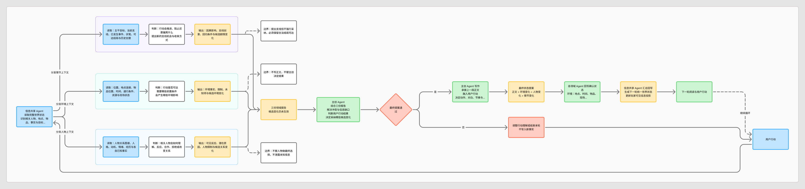

# 互动小说完整 Agent Loop

这份文档描述一轮互动小说从用户行动到下一轮状态的完整写作链路。核心原则是：**信息共享负责把世界资料分发正确，三个领域 Agent 提供分析和候选状态变化，主创 Agent 负责最终裁决与写作，确认后的变化再回写到各领域状态。**

[在 Figma 中查看完整 Agent Loop 详细版](https://www.figma.com/board/bDLUgDFQaZveJfy21Y8YXw/%E4%BA%92%E5%8A%A8%E5%B0%8F%E8%AF%B4%E9%80%9A%E7%94%A8%E5%B7%A5%E4%BD%9C%E6%B5%81%EF%BD%9C%E5%BD%93%E5%89%8D%E9%A1%B9%E7%9B%AE%E5%AF%BC%E8%A7%88?node-id=37-760)



## 一轮写作怎么运转

```text
用户行动
  ↓
共享信息：识别相关人物、地点、物品、事实和剧情目标
  ↓
环境 / 人物 / 情节 Agent 并行分析
  ↓
各自提交领域信息与候选状态变化
  ↓
主创 Agent 综合、解决冲突、决定最终结果
  ↓
主创 Agent 写出下一段正文和最终状态提案
  ↓
环境 / 人物 / 情节 Agent 按确认结果更新各自状态
  ↓
共享信息汇总为下一轮统一世界状态
```

三个子 Agent 的报告在主创确认前都只是候选，不会自动成为世界事实。主创 Agent 是唯一的最终裁决者和写作者。

## 1. 用户行动进入共享信息层

共享信息层维护完整世界记录，但不会把全量资料原样交给每个 Agent。它先理解本轮行动，再沿着行动依赖筛选上下文。

例如用户说“让人物 A 去 B 地找物品 C”，共享信息层会识别出人物 A、地点 B、物品 C，以及“前往—寻找—取得”的行动关系，然后分别整理：环境需要路线和取得条件，人物需要动机与知识，情节需要目标和路线影响。

## 2. 三个领域 Agent 提供支撑并提出候选变化

### 环境 Agent

回答“这个行动在现场是否可行”。它查询人物位置、地点连接、物品位置、通行条件、时间、资源、危险和现场变化，提交已确认事实、限制、相关资源、未知信息，以及可能的环境变化。

它不决定用户是否成功，也不直接移动人物或拿走物品。只有主创提案确认后，环境状态才正式更新。

### 人物 Agent

回答“相关人物会怎样反应”。它查询人物关系网、人格、动机、当前情绪、身体状态、经历、各自知道的事实和近期事件，提交可观察反应、潜在原因、当前意图、禁止行为，以及候选的关系、知识和记忆变化。

它不替人物做最终选择，也不替玩家决定内心。关系图谱可以保留真实关系、人物各自认知和分支历史，但前端只显示玩家有权知道的投影。

### 情节 Agent

回答“这次行动会给故事增加什么可能”。它查询当前主干目标、支线、已发生事件、可达结局和已经使用过的创意，提交因果影响、支线创意、触发原因、后续问题、回归条件和可达结局。

它可以让故事偏离主线，但每条被采纳的支线必须仍然能够到达至少一个合法结局。它提出创意，不直接推进节点，也不写完整剧情。

## 3. 主创 Agent 综合和写作

主创 Agent 收到三份报告后，负责解决冲突并形成唯一的最终提案。它需要判断：

- 用户行动的真实意图是什么；
- 环境条件是否允许行动成立；
- 人物反应是否符合关系和知识边界；
- 情节支线是否有价值且仍可收束到结局；
- 哪些候选状态变化真的发生；
- 本轮正文应该如何承接上一段。

主创输出两部分：

```text
最终正文
最终状态提案
```

正文是用户看到的故事内容；状态提案说明本轮确定发生的环境、人物、关系、知识、剧情和记忆变化。

## 4. 状态回写和下一轮

主创确认后的状态提案交回各领域 Agent：

```text
环境 Agent：更新地点、时间、物品、通道和现场状态
人物 Agent：更新位置、情绪、关系、知识和人物记忆
情节 Agent：更新主线、支线、目标、伏笔和结局可达性
共享信息层：合并三类变化，形成统一的下一轮世界状态
```

如果某个 Agent 在分析中发现了原先没有记录的新内容，它只能提交为“候选事实”。主创采纳后，才能正式写入共享世界状态。

## 5. 信息筛选的基本规则

相关信息不是“同一个地点”或“同一个人物”这么简单，而是要沿行动的前置条件继续展开：

```text
用户想使用 C
→ C 在哪里
→ 谁能取得 C
→ 取得 C 需要什么
→ 当前地点是否可达
→ 取得过程会影响什么人物和剧情目标
```

共享信息层负责把这条依赖链查出来，再把不同领域所需的部分分别交给三个 Agent。这样主创 Agent 收到的是与本轮行动真正有关的信息，而不是整个世界的资料倾倒。

## 6. 当前项目中的边界

- 子 Agent 提供领域分析和候选变化，不直接写正文。
- 主创 Agent 是最终裁决者和唯一写作者。
- 候选变化在主创确认前不是事实。
- 支线可以长期偏离主线，但必须保持至少一个合法结局可达。
- 信息共享层保存完整状态；前端只展示当前玩家有权知道的人物、关系、线索和环境信息。
- 环境、人物、情节三个领域可以各自维护专业状态，但通过共享信息层交换本轮真正相关的内容。

## 7. 一句话理解

**共享信息层负责让大家拿到正确资料，三个领域 Agent 负责从各自角度提出依据，主创 Agent 负责决定故事发生什么并把它写出来，确认后的结果再成为下一轮的世界状态。**

## 8. 这条链路在项目中的落点

当前实现把“信息共享 Agent”落成了一个确定性的共享信息层：它不额外调用模型，也不自行创作内容，而是从当前事件的完整 `stateAfter`、故事包、分支记忆和用户行动生成可追溯的 `sharedContext`。这样每次传给模型的资料都能复现，也不会因为共享层自己猜错而污染世界状态。

对应代码职责如下：

```text
src/story-context.js
  完整世界状态 → 行动依赖筛选 → environment / character / plot 上下文

src/pi-story-runtime.js
  三个领域 Agent 并行报告 → 主创 Agent 裁决 → 正文生成

src/story-engine.js
  校验最终提案 → 原子应用环境、人物、剧情和关系变化

src/story-domain.js
  保存正文、最终提案、三个领域报告和本轮 sharedContext

src/story-store.js
  持久化分支事件、环境状态、人物状态和关系图
```

`candidateChanges` 是三个领域报告新增的候选变化字段。它们会随事件保存，方便审查“Agent 当时建议了什么”；只有主创最终提案中的 `delta`、`storyProgress`、`ending` 和记忆字段会改变正式世界状态。项目用一次原子状态应用完成三个领域的确认回写，再由下一轮 `buildSharedContext` 重新汇总。前端序列化时会返回玩家可见人物的 `relationshipGraph`，隐藏人物和隐藏关系不会泄露。
